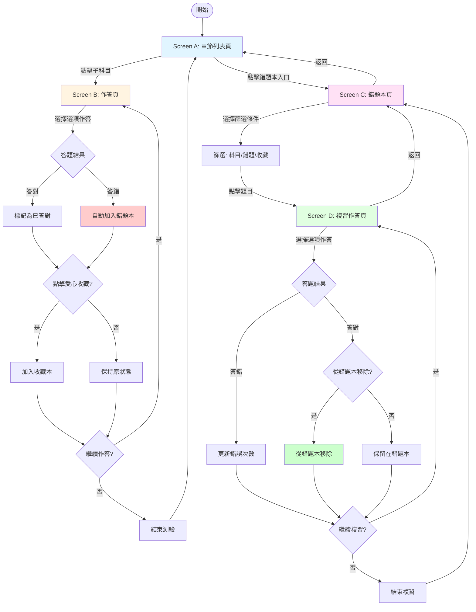

# 金融證照考試題庫 App - UX 流程圖

## 一、介面清單與功能細節

### Screen A: 章節列表頁

**功能描述：**
- **主要內容：**
  - 顯示所有子科目列表（如：共同科目 1.職業安全衛生、共同科目 2.工作倫理與職業道德等）
  - 每個子科目顯示完成百分比（如：0%、25%、100%）
  - 顯示星號標記（收藏狀態）
  - 可點擊任一子科目進入作答頁

- **錯題本入口（必備）：**
  - 位於頁面最底部
  - 顯示為「❤️ 錯題與收藏本」
  - 顯示括號內的題目總數，格式：「❤️ 錯題與收藏本 (15)」
  - 點擊後進入錯題本頁（Screen C）

- **其他功能：**
  - 頂部導航欄顯示「共同科目」標題
  - 返回按鈕（左上角）
  - 收藏/釘選功能（右上角圖標）
  - 選單功能（右上角三點圖標）

---

### Screen B: 作答頁

**功能描述：**
- **題目顯示區域：**
  - 顯示完整題目內容
  - 顯示四個選項（A/B/C/D）
  - 顯示進度條（如：1/99）
  - 顯示當前章節名稱（如：共同科目 1.職業安全衛生）

- **互動功能：**
  - **選項選擇：** 點擊任一選項進行作答
  - **愛心收藏按鈕：** 點擊後將題目加入收藏本
    - 已收藏狀態：顯示實心愛心 ❤️
    - 未收藏狀態：顯示空心愛心 🤍
  - **答題後處理：**
    - 答對：顯示正確提示，題目標記為「已答對」
    - 答錯：顯示錯誤提示並標示正確答案，**題目自動加入錯題本**
    - 顯示詳解（可選）

- **導航功能：**
  - 「上一題」按鈕：返回上一題
  - 「下一題」按鈕：前往下一題
  - 「結束測驗」按鈕：結束當前測驗並返回章節列表頁
  - 返回按鈕（頂部左側）

- **其他功能：**
  - 查詢問題功能
  - 問題回報功能
  - 評分功能（五顆星）
  - 字體大小調整（放大/縮小）

---

### Screen C: 錯題本頁

**功能描述：**
- **篩選功能（必備）：**
  - **依科目篩選：** 下拉選單選擇特定科目（如：共同科目 1、共同科目 2、全部）
  - **僅複習錯題：** 切換開關，只顯示答錯的題目
  - **僅複習收藏題：** 切換開關，只顯示收藏的題目
  - 可同時使用多個篩選條件

- **題目列表顯示：**
  - 顯示錯題/收藏題的列表
  - 每項顯示：
    - 題目簡述（前30-50字）
    - 錯誤次數（如：錯誤 3 次）
    - 收藏狀態圖標（❤️ 或 🤍）
    - 所屬科目標籤
  - 點擊任一題目進入複習作答頁（Screen D）

- **統計資訊：**
  - 顯示總題數（如：共 15 題）
  - 顯示錯題數（如：錯題 12 題）
  - 顯示收藏題數（如：收藏 8 題）

- **導航功能：**
  - 返回按鈕（返回章節列表頁）
  - 標題顯示「錯題與收藏本」

---

### Screen D: 複習作答頁

**功能描述：**
- **題目顯示區域：**
  - 顯示完整題目內容
  - 顯示四個選項（A/B/C/D）
  - 顯示進度條（如：3/15，表示錯題本中的進度）
  - 顯示當前題目狀態標籤（如：「錯題」或「收藏」）

- **複習模式特殊功能：**
  - **「從錯題本移除」按鈕（必備）：**
    - 位於題目下方或選項區域
    - 點擊後確認對話框：「確定要將此題從錯題本移除嗎？」
    - 確認後，題目從錯題本中移除
    - 如果題目同時是錯題和收藏，移除時可選擇「僅移除錯題標記」或「完全移除」

- **互動功能：**
  - **選項選擇：** 點擊選項進行作答
  - **愛心收藏按鈕：** 可切換收藏狀態
  - **答題後處理：**
    - 顯示正確/錯誤提示
    - 顯示詳解
    - 如果答對，可提示「是否從錯題本移除？」

- **導航功能：**
  - 「上一題」按鈕：返回上一題
  - 「下一題」按鈕：前往下一題
  - 「結束複習」按鈕：結束複習並返回錯題本頁
  - 返回按鈕（頂部左側）

- **其他功能：**
  - 查詢問題功能
  - 問題回報功能
  - 顯示錯誤次數統計

---

## 二、User Journey 流程圖



---

## 三、關鍵流程說明

### 1. 作答階段流程

```
章節列表頁 (Screen A)
    ↓ [點擊子科目]
作答頁 (Screen B)
    ↓ [選擇選項]
    ├─ 答對 → 標記已答對
    └─ 答錯 → 自動加入錯題本
    ↓ [可選：點擊愛心收藏]
    ├─ 收藏 → 加入收藏本
    └─ 不收藏 → 保持原狀態
    ↓ [繼續作答 或 結束測驗]
章節列表頁 (Screen A)
```

### 2. 紀錄階段流程

```
系統自動記錄：
├─ 答錯題目 → 寫入錯題資料庫
│   └─ 記錄錯誤次數
│   └─ 記錄答錯時間
│
└─ 手動收藏題目 → 寫入收藏資料庫
    └─ 記錄收藏時間
    └─ 記錄收藏狀態
```

### 3. 複習階段流程

```
章節列表頁 (Screen A)
    ↓ [點擊「❤️ 錯題與收藏本」]
錯題本頁 (Screen C)
    ↓ [選擇篩選條件]
    ├─ 依科目篩選
    ├─ 僅複習錯題
    └─ 僅複習收藏題
    ↓ [點擊題目]
複習作答頁 (Screen D)
    ↓ [選擇選項作答]
    ├─ 答對 → 可選擇「從錯題本移除」
    └─ 答錯 → 更新錯誤次數
    ↓ [點擊「從錯題本移除」]
    └─ 確認對話框 → 移除題目
    ↓ [繼續複習 或 結束複習]
錯題本頁 (Screen C)
    ↓ [返回]
章節列表頁 (Screen A)
```

---

## 四、資料結構說明

### 題目資料結構
```typescript
interface Question {
  id: string;                    // 題目ID
  content: string;               // 題目內容
  options: {
    A: string;
    B: string;
    C: string;
    D: string;
  };
  correctAnswer: 'A' | 'B' | 'C' | 'D';  // 正確答案
  explanation: string;           // 詳解
  subject: string;               // 所屬科目
  chapter: string;               // 所屬章節
}
```

### 用戶答題狀態
```typescript
interface UserAnswer {
  questionId: string;
  isCorrect: boolean;            // 是否答對
  isAnswered: boolean;           // 是否已作答
  isFavorite: boolean;           // 是否收藏
  isInWrongBook: boolean;        // 是否在錯題本
  wrongCount: number;            // 錯誤次數
  lastAnsweredAt?: Date;         // 最後答題時間
  lastWrongAt?: Date;            // 最後答錯時間
}
```

---

## 五、狀態轉換規則

### 錯題本加入規則
- **自動加入：** 用戶在作答頁（Screen B）答錯時，系統自動將題目加入錯題本
- **手動加入：** 用戶在作答頁點擊愛心收藏，題目加入收藏本（同時可視為錯題本的一部分）

### 錯題本移除規則
- **手動移除：** 用戶在複習作答頁（Screen D）點擊「從錯題本移除」按鈕
- **自動移除（可選）：** 用戶在複習作答頁連續答對 N 次後，系統可提示是否移除（此為進階功能，可選）

### 狀態同步規則
- 題目可同時存在於「錯題」和「收藏」兩個狀態
- 移除錯題標記時，如果題目同時是收藏狀態，可選擇「僅移除錯題標記」或「完全移除」
- 錯題本頁的總數統計需同步更新


