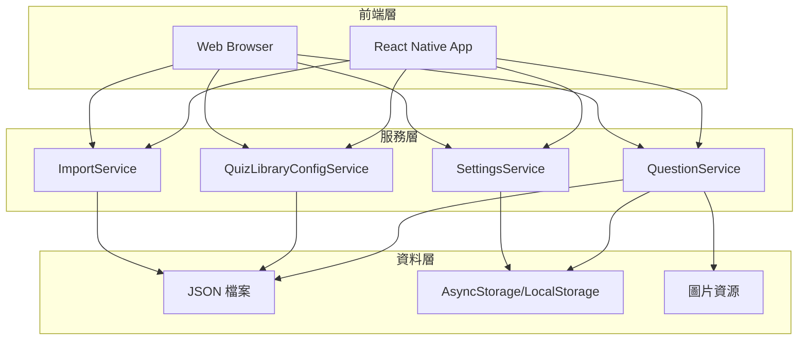
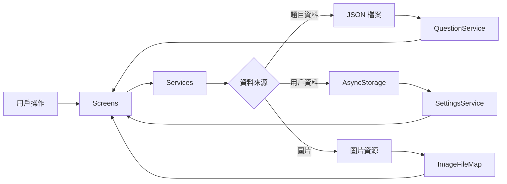
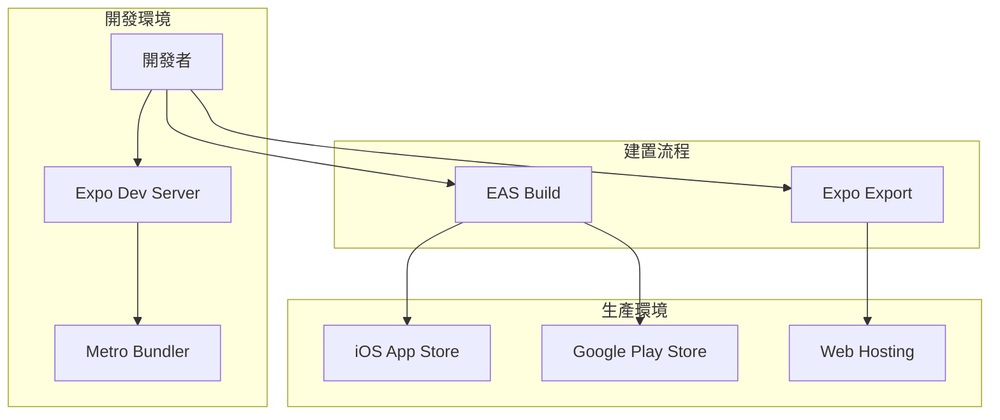

# WITS證照考試題庫 App - 網站架構說明

本文檔詳細說明專案的整體架構設計，包括技術架構、專案結構、資料架構、服務層架構和部署架構。

## 📋 目錄

1. [技術架構](#技術架構)
2. [專案結構](#專案結構)
3. [資料架構](#資料架構)
4. [服務層架構](#服務層架構)
5. [前端架構](#前端架構)
6. [部署架構](#部署架構)
7. [架構圖](#架構圖)

---

## 技術架構

### 核心技術棧

- **框架**：React Native + Expo (~54.0.27)
- **導航**：React Navigation (Native Stack)
- **資料儲存**：AsyncStorage（行動裝置）/ LocalStorage（Web）
- **語言**：TypeScript
- **題目資料格式**：JSON 檔案（按需載入）
- **資料轉換工具**：Excel 轉 JSON 腳本

### 平台支援

- ✅ **Web**：使用 `react-native-web` 和 `react-dom` 支援瀏覽器運行
- ✅ **iOS**：原生 iOS 應用程式
- ✅ **Android**：原生 Android 應用程式

### 開發工具

- **Metro Bundler**：JavaScript 打包工具
- **Expo CLI**：開發和建置工具
- **TypeScript**：型別檢查和開發體驗

---

## 專案結構

```
quiz/
├── assets/                          # 靜態資源目錄
│   ├── config/                      # 配置檔案目錄
│   │   └── quiz-library-config.json # 題庫配置檔案
│   ├── data/                        # 資料目錄
│   │   ├── questions.json           # 題目索引檔案（自動生成）
│   │   └── questions/               # 題目 JSON 檔案目錄
│   │       ├── IPAS_01/             # IPAS 初級題庫
│   │       │   ├── L11/             # 科目 L11
│   │       │   │   ├── 11401.json   # 期數 11401 的題目
│   │       │   │   └── ...
│   │       │   └── L12/             # 科目 L12
│   │       ├── IPAS_02/             # IPAS 中級題庫
│   │       ├── AZ900/               # AZ900 題庫
│   │       └── JAVA/                # Java 題庫
│   └── images/                      # 圖片資源目錄
│       ├── IPAS_01/
│       │   └── L11/
│       │       └── 11401/           # 期數 11401 的圖片
│       │           ├── 3Q1.png      # 題目圖片
│       │           └── ...
│       └── IPAS_02/
│           └── L23/
│               └── 11411/
├── src/                              # 原始碼目錄
│   ├── components/                  # React 元件
│   │   ├── ExpandableText.tsx       # 可展開文字元件
│   │   ├── RichTextWithImages.tsx   # 富文字與圖片元件
│   │   ├── SearchQuestionModal.tsx  # 搜尋題目模組
│   │   ├── SettingsModal.tsx        # 設定模組
│   │   └── TestNameSelectorModal.tsx # 測驗名稱選擇器
│   ├── contexts/                    # React Context
│   │   └── ThemeContext.tsx         # 主題上下文
│   ├── screens/                     # 畫面元件
│   │   ├── TestNameListScreen.tsx   # 測驗名稱列表頁
│   │   ├── SubjectListScreen.tsx    # 科目列表頁
│   │   ├── SeriesListScreen.tsx     # 期數列表頁
│   │   ├── QuizScreen.tsx           # 作答頁
│   │   ├── WrongBookScreen.tsx      # 錯題本頁
│   │   ├── ReviewQuizScreen.tsx     # 複習作答頁
│   │   ├── FileNameListScreen.tsx   # 檔案名稱列表頁
│   │   ├── ImportWebViewScreen.tsx  # 匯入 WebView 頁
│   │   └── ImportConfigScreen.tsx   # 匯入設定頁
│   ├── services/                    # 服務層
│   │   ├── QuestionService.ts      # 題目服務（核心）
│   │   ├── questionFileMap.ts      # 題目檔案映射表（自動生成）
│   │   ├── imageFileMap.ts          # 圖片檔案映射表（自動生成）
│   │   ├── QuizLibraryConfigService.ts # 題庫配置服務
│   │   ├── QuizServerService.ts     # 題庫伺服器服務
│   │   ├── ImportService.ts         # 匯入服務
│   │   └── SettingsService.ts      # 設定服務
│   ├── types/                       # TypeScript 類型定義
│   │   └── index.ts                 # 共用類型定義
│   └── utils/                       # 工具函數
│       ├── storage.ts               # 儲存工具
│       └── questionUtils.ts         # 題目工具
├── scripts/                          # 腳本目錄
│   ├── updateQuestionIndex.js       # 更新題目索引（重要）
│   ├── updateImageFileMap.js        # 更新圖片映射表
│   ├── validatePaths.js             # 驗證路徑連結
│   ├── validateJson.js              # 驗證 JSON 格式
│   ├── convertExcelToJSON.js         # Excel 轉 JSON
│   └── git/                          # Git 相關腳本
├── docs/                             # 文檔目錄
│   ├── 開發相關/                    # 開發相關文檔
│   ├── 建置與部署/                  # 建置與部署文檔
│   ├── 測試相關/                    # 測試相關文檔
│   ├── 資料管理/                    # 資料管理文檔
│   ├── 安裝與設定/                  # 安裝與設定文檔
│   └── 其他/                        # 其他文檔
├── tests/                           # 測試目錄
│   └── e2e/                         # 端對端測試
├── web/                             # Web 版本專用檔案
│   └── index.html                   # HTML 入口檔案
├── App.tsx                          # 應用程式入口
├── package.json                     # 專案配置
├── app.json                         # Expo 配置
├── metro.config.js                  # Metro Bundler 配置
└── README.md                        # 專案說明文件
```

### 目錄說明

#### `assets/` - 靜態資源
- **config/**：應用程式配置檔案
- **data/**：題目資料和索引檔案
- **images/**：圖片資源（題目圖片、選項圖片）

#### `src/` - 原始碼
- **components/**：可重用的 React 元件
- **contexts/**：React Context 提供者（主題、狀態管理）
- **screens/**：應用程式的主要畫面元件
- **services/**：業務邏輯和資料服務層
- **types/**：TypeScript 類型定義
- **utils/**：工具函數

#### `scripts/` - 腳本工具
- 資料處理和維護腳本
- Git 相關腳本
- 本地開發伺服器

---

## 資料架構

### 資料儲存層級

```
┌─────────────────────────────────────┐
│  應用程式層 (App Layer)              │
│  - Screens                          │
│  - Components                       │
└──────────────┬──────────────────────┘
               │
┌──────────────▼──────────────────────┐
│  服務層 (Service Layer)              │
│  - QuestionService                  │
│  - QuizLibraryConfigService         │
│  - SettingsService                  │
└──────────────┬──────────────────────┘
               │
┌──────────────▼──────────────────────┐
│  資料層 (Data Layer)                │
│  - JSON 檔案（題目資料）            │
│  - AsyncStorage（用戶資料）         │
│  - LocalStorage（Web 用戶資料）     │
└─────────────────────────────────────┘
```

### 題目資料結構

題目資料採用**三層資料夾結構**：

1. **第一層**：測驗名稱（如 `IPAS_01`、`AZ900`、`JAVA`）
2. **第二層**：科目名稱（如 `L11`、`part1`、`Spring boot`）
3. **第三層**：期數檔案（如 `11401.json`、`20251216.json`）

**路徑格式**：
```
assets/data/questions/{testName}/{subject}/{series_no}.json
```

### 索引檔案 (`questions.json`)

索引檔案是整個系統的核心，包含：

```json
{
  "metadata": {
    "version": "3.0.0",
    "lastUpdated": "2025-12-16...",
    "totalQuestions": 1088
  },
  "testNames": [...],      // 測驗名稱列表
  "subjects": [...],       // 科目列表
  "series": [...],         // 期數列表
  "questionFiles": [...]   // 題目檔案清單
}
```

### 用戶資料儲存

- **行動裝置**：使用 `AsyncStorage` 儲存
  - 鍵值：`@quiz:userAnswers`
  - 內容：答題記錄、錯題本、收藏狀態

- **Web 平台**：使用 `LocalStorage` 儲存
  - 相同的鍵值和資料結構
  - 瀏覽器本地儲存

### 圖片資源結構

圖片資源採用相同的三層結構：

```
assets/images/{testName}/{subject}/{series_no}/{imageFile}
```

**命名規則**：
- 題目圖片：`{題號}Q{序號}.png`（如：`45Q1.png`）
- 選項圖片：`{題號}{選項}{序號}.png`（如：`45A1.png`）

---

## 服務層架構

### 核心服務

#### 1. QuestionService（題目服務）

**職責**：
- 載入題目索引檔案
- 按需載入題目檔案
- 提供題目查詢介面
- 管理題目資料快取

**主要方法**：
- `loadIndexData()`：載入索引資料
- `loadQuestions()`：載入題目檔案
- `getTestNames()`：取得測驗名稱列表
- `getSubjects()`：取得科目列表
- `getSeries()`：取得期數列表

#### 2. QuizLibraryConfigService（題庫配置服務）

**職責**：
- 載入題庫配置檔案
- 管理題庫設定
- 提供配置查詢介面

#### 3. SettingsService（設定服務）

**職責**：
- 管理應用程式設定
- 儲存和讀取用戶偏好設定

#### 4. ImportService（匯入服務）

**職責**：
- 處理題目資料匯入
- 驗證匯入資料格式
- 整合外部題庫伺服器

### 服務層設計模式

- **單例模式**：每個服務都是單例，確保全域唯一實例
- **異步載入**：所有資料載入都是異步操作
- **快取機制**：載入的資料會快取在記憶體中
- **錯誤處理**：統一的錯誤處理機制

---

## 前端架構

### 畫面層級結構

```
App.tsx (根元件)
  └── NavigationContainer
      └── Stack Navigator
          ├── FileNameListScreen
          ├── TestNameListScreen
          ├── SubjectListScreen
          ├── SeriesListScreen
          ├── QuizScreen
          ├── WrongBookScreen
          ├── ReviewQuizScreen
          ├── ImportWebViewScreen
          └── ImportConfigScreen
```

### 元件層級

- **Screens**：主要畫面元件，負責業務邏輯和狀態管理
- **Components**：可重用元件，負責 UI 呈現
- **Contexts**：全域狀態管理（主題、設定等）

### 導航架構

使用 **React Navigation** 的 Native Stack Navigator：

- **堆疊導航**：支援前進和返回
- **參數傳遞**：透過路由參數傳遞資料
- **類型安全**：使用 TypeScript 定義路由參數類型

---

## 部署架構

### Web 版本部署

#### 開發模式
```
Expo Dev Server
  └── Metro Bundler
      └── Webpack (react-native-web)
          └── 瀏覽器
```

#### 生產模式
```
靜態檔案建置
  └── npx expo export:web
      └── web-build/ 目錄
          └── 靜態網站託管
              ├── Vercel
              ├── Netlify
              ├── GitHub Pages
              └── AWS S3
```

**特點**：
- 完全靜態，無需後端伺服器
- 支援 CDN 加速
- 自動 HTTPS
- 全球分發

### 行動應用程式部署

#### iOS
```
EAS Build
  └── Apple Developer
      └── App Store Connect
          └── App Store
```

#### Android
```
EAS Build
  └── Google Play Console
      └── Google Play Store
```

### 資料部署

- **題目資料**：打包到應用程式中（`assets/` 目錄）
- **圖片資源**：打包到應用程式中
- **用戶資料**：儲存在本地裝置

---

## 架構圖

### 系統架構圖



### 資料流程圖



### 部署架構圖



---

## 技術決策說明

### 為什麼選擇 React Native + Expo？

1. **跨平台開發**：一套程式碼支援 iOS、Android 和 Web
2. **快速開發**：Expo 提供完整的開發工具鏈
3. **生態系統**：豐富的第三方套件支援
4. **型別安全**：TypeScript 提供完整的型別檢查

### 為什麼使用 JSON 檔案儲存題目？

1. **簡單直接**：無需資料庫，易於維護
2. **版本控制**：可以透過 Git 追蹤變更
3. **按需載入**：只載入需要的題目檔案
4. **離線支援**：資料打包在應用程式中

### 為什麼使用 AsyncStorage/LocalStorage？

1. **本地儲存**：用戶資料儲存在本地，保護隱私
2. **快速存取**：無需網路請求
3. **跨平台**：AsyncStorage 在 Web 上自動使用 LocalStorage
4. **簡單 API**：易於使用和維護

---

## 相關文檔

- [專案結構與路徑說明](./專案結構與路徑說明.md) - 詳細的路徑結構和引用說明
- [檔案功能說明](./檔案功能說明.md) - 各檔案和腳本的功能說明
- [Web 版本設定](./建置與部署/WEB_SETUP.md) - Web 版本的部署說明
- [開發指南](./開發指南.md) - 開發環境設定和流程

---

## 更新記錄

- **2025-12-XX**：建立統一的網站架構說明文件
- 整合技術架構、專案結構、資料架構等資訊
- 新增架構圖和技術決策說明

